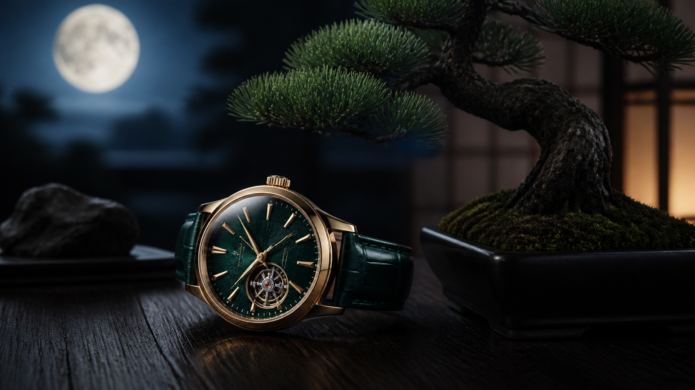
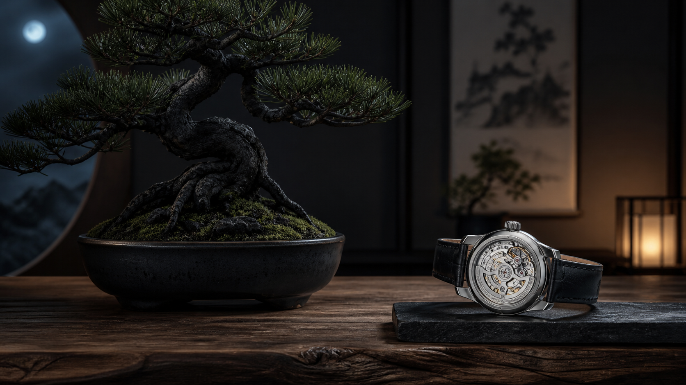

# 盆栽の美しさを腕元に。国内600本「セイコー プレザージュ × TRADMAN'S BONSAI」の見どころ

- **SEOタイトル:** セイコー プレザージュ×TRADMAN'S BONSAI｜国内600本の限定時計
- **メタディスクリプション:** 月明かりに照らされた黒松を表現した、セイコー プレザージュとTRADMAN'S BONSAIの限定モデル。価格、発売時期、限定数、型番の違いを紹介します。
- **カテゴリ候補:** ろぶーズセレクション
- **タグ候補:** セイコー, プレザージュ, TRADMAN'S BONSAI, 盆栽, 日本製時計, 限定モデル
- **アイキャッチ画像:** `../assets/images/draft_articles/02-seiko-bonsai-hero.png`

## 本文

今回の「ろぶーズセレクション」で気になったのは、セイコー プレザージュのクラシックシリーズとTRADMAN'S BONSAIが組んだ限定モデル「HCC011J」です。和柄を時計へ加えただけではありません。着想源は月明かりに照らされる黒松の盆栽。静かな夜の景色を腕時計へ落とし込む、いかにも日本らしく、それでいて現代的な一本です。

TRADMAN'S BONSAIは、日本の盆栽文化を世界へ伝えることを掲げ、伝統を保存するだけでなく、ファッションやアートと組み合わせて新しい価値を提案してきました。プレザージュも、日本の美意識と機械式時計づくりを柱にするシリーズです。両者の組み合わせには、見た目だけではない納得感があります。

一番見てみたいのは文字盤です。盆栽は枝ぶりや幹、鉢、余白まで含めて小さな景色をつくるもの。この時計も強い装飾を重ねるというより、色と質感、光の変化で黒松の存在感を表現しています。スーツには落ち着いてなじみ、休日の和装やシンプルな服では静かな主役になる。毎日使える範囲に「作品らしさ」が残っているのが魅力です。

公式情報によると、国内モデルHCC011Jは2026年9月発売予定で、価格は税込176,000円。国内限定600本で、セイコーグローバルブランドコアショップ専用モデルです。裏ぶたにはTRADMAN'S BONSAIのロゴ、「LIMITED EDITION」の文字、シリアルナンバーが入ります。限定数が明確なので、気になる人は発売前に正規店の取り扱い方法を確認しておきたいところです。

ここで注意したいのが型番です。海外向け公式ページに掲載されるHCC009は2,000本限定と案内されています。国内版と海外版では型番、限定数、価格、保証窓口が異なる可能性があります。楽天やeBayで探す場合は、商品名だけで判断せず、HCC011JなのかHCC009なのか、付属品と保証書を含めて確認する必要があります。

限定時計は「限定」という言葉だけで急いで買わないことも大切です。腕周りへの収まり、文字盤の見え方、ベルトの感触は写真だけでは分かりません。正規店での保証や将来のメンテナンス、海外出品なら関税、送料、返品条件、真贋確認も含めて比べたいです。公式価格との差が大きい場合は、その理由まで見ておきましょう。

盆栽は長い時間をかけて育て、その日の光や季節で異なる表情を楽しむ文化です。機械式時計も、手入れをしながら長く付き合うもの。すぐに消費して終わる品ではないという共通点が、このコラボを特別に見せている気がします。日本製時計が好きな人はもちろん、盆栽や和の空間づくりに惹かれる人にも届きそうです。

ろぶーとしては、実物の文字盤が自然光でどう変化するのかが一番気になります。腕元に小さな黒松の景色を置く。そんな選び方ができる時計として、発売時に改めて実物を確認したいセレクションです。

> **公式リンク挿入位置:** [セイコー公式 HCC011J商品ページ](https://www.seikowatches.com/jp-ja/products/presage/hcc011j)

> **アフィリエイトリンク挿入位置:** 楽天でプレザージュを探す／eBayでHCC011J・HCC009を確認する（公開前に提携URLへ差し替え）

> **内部リンク挿入位置:** 既存のセイコー アストロン記事、ブライトリング記事など時計カテゴリへ

### 参考情報

- [セイコー公式：HCC011J](https://www.seikowatches.com/jp-ja/products/presage/hcc011j)
- [セイコー公式：海外向けHCC009](https://www.seikowatches.com/middleeast-en/products/presage/hcc009j1)

