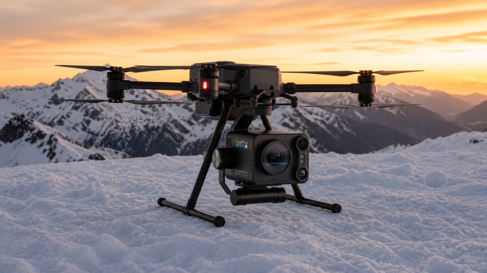
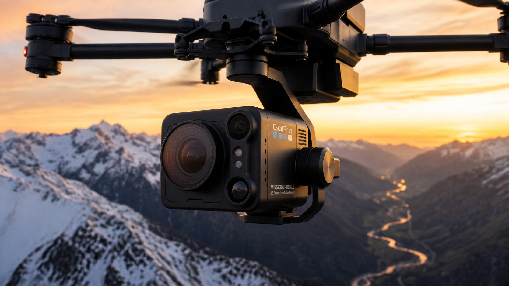

# GoPro MISSION 1 PRO ILSとは？197g・8K・レンズ交換をやさしく解説

- **status:** draft
- **noindex:** true
- **掲載先:** Robu’s Selection
- **SEOタイトル:** GoPro MISSION 1 PRO ILSとは？197g・8K・レンズ交換をやさしく解説
- **メタディスクリプション:** GoPro MISSION 1 PRO ILSは何ができるカメラなのか。197g、8K60、MFTレンズ交換、寒冷地での動作温度、価格と注意点を公式情報だけで分かりやすく紹介します。
- **フォーカスキーフレーズ:** GoPro MISSION 1 PRO ILS
- **推奨スラッグ:** gopro-mission-1-pro-ils
- **カテゴリ:** Robu’s Selection / カメラ・映像機器
- **タグ:** GoPro, MISSION 1 PRO ILS, 8Kカメラ, MFT, シネマカメラ, 映像制作
- **アイキャッチ画像:** ../assets/images/draft_articles/05-gopro-mission-1-pro-ils-hero.png

*画像：AI生成による利用イメージです。GoPro公式写真、実機撮影、性能試験ではありません。ドローンや取付部品の形も実物を保証しません。*

## まず一言でいうと

「MISSION 1 PRO ILS」は、GoProが発表した小型のレンズ交換式シネマカメラだ。

本体だけの重さは**197g**。小さなボディで**最大8K60の動画撮影**に対応し、用途に合わせて**Micro Four Thirds（MFT）レンズ**を交換できる。

難しい比較を抜きにすると、特徴は次の5つだ。

1. 本体重量は197g
2. 最大8K60、4K240で撮影できる
3. MFTレンズを交換できる
4. 手ぶれ補正「HyperSmooth」に対応する
5. 公式の動作温度は−20℃から45℃

ここから、一つずつ簡単に見ていこう。

## 197gの小さなカメラ

公式仕様の重量は197g。最初に出回った「97g」ではなく、正しくは**197g**だ。

小さいため、撮影機材をできるだけ軽くしたい場面や、限られた場所へカメラを取り付けたい時に使いやすそうだ。ただし、実際に使う時はレンズ、バッテリー、固定部品の重さも加わる。

*画像：AI生成による撮影イメージです。実際のMISSION 1 PRO ILSの細部や撮影結果を再現したものではありません。*

## 8Kで何ができるのか

通常の16:9動画では、最大**8K60**と**4K240**に対応する。

Open Gateという撮影方法では、センサーの広い範囲を使って最大8K30、4K120で記録できる。あとから横長の動画、縦型のショート動画などへ切り出しやすいのが利点だ。

10-bitカラー、GP-Log2、HLG HDR、タイムコード同期にも対応している。これは撮影後に色を調整したり、複数のカメラ映像を合わせたりするための機能だ。

## レンズ交換で注意すること

MFTはレンズを取り替えられる仕組みの名前だ。

ただし、このカメラ本体にはレンズ用の電子接点がない。GoPro公式では、基本的に**手動でピントを合わせ、手動または固定絞りのレンズを使う**と説明している。

カメラ任せのオートフォーカスではなく、撮影する人が自分でピントを決めるタイプだ。ピント合わせを助けるフォーカスアシストとフォーカスピーキングは搭載されている。

## 寒い場所でも撮れるのか

GoPro公式仕様の動作温度は**−20℃から45℃**。仕様上は雪山などの寒い場所でも使用できる範囲が示されている。

ただし、低温ではバッテリーの持続時間が短くなることがある。また、寒い屋外から暖かい室内へ移動すると結露が起きる可能性がある。

公式発表の「4K30で3時間超」という連続撮影時間は、25℃で測定された数値だ。寒冷地で同じ時間を保証する数字ではない。

## AI生成の360度イメージ映像

<video controls playsinline preload="metadata" poster="../assets/images/draft_articles/05-gopro-mission-1-pro-ils-inline.png" style="width:100%;height:auto;">
  <source src="../assets/videos/draft_articles/05-gopro-mission-1-pro-ils-360-concept.mp4" type="video/mp4">
  お使いのブラウザは動画再生に対応していません。
</video>

*動画：AI生成による製品イメージです。GoPro公式映像、実機撮影、性能検証ではありません。*

この映像は製品の雰囲気を見るための参考表現だ。カメラの細部、レンズ、取付方法、寸法、動作を正確に確認する資料ではない。正確な形や仕様はGoPro公式ページで確認してほしい。

## 価格と発売時期

米国での公式価格は**699.99ドル**。既存のGoProサブスクリプション利用者向け価格は**599.99ドル**と案内されている。MFTレンズは別売りだ。

予約は2026年8月26日に始まり、米国での一般販売は9月予定。日本での価格、発売日、保証内容は、日本向け公式情報の発表を確認したい。

## 買う前に確認したいこと

- MFTレンズは別に用意する
- オートフォーカスではなく手動でピントを合わせる
- 8K撮影では保存容量が大きくなる
- 寒い場所ではバッテリー時間が短くなる可能性がある
- AI生成の画像と動画は、実物の形や性能を示す資料ではない

## ろぶーの結論

MISSION 1 PRO ILSは、**197gの小さな本体で8K撮影ができ、レンズも交換できるカメラ**だ。

魅力は「小さい」「高解像度」「レンズを選べる」の3点。注意点は、ピント合わせが手動で、レンズを別に用意する必要があることだ。

まだ実機を試していないので、画質や使いやすさは断定しない。日本での販売情報と実機レビューが出てから、もう一度確かめたい。

## 内部リンク候補

- カメラ・ウェアラブル・旅行ガジェット関連記事
- 動画編集、YouTube字幕・吹き替え関連記事
- ドローンや航空機撮影に関する記事

## 公式出典

- [GoPro公式：MISSION 1 PRO ILS発表](https://gopro.com/en/us/news/mission-1-pro-ils-interchangeable-lens-cinema-camera)
- [GoPro公式：MISSION 1 PRO ILS日本語製品・技術仕様](https://gopro.com/ja/jp/shop/learn-cameras/mission-1-pro-ils)
- [GoPro投資家向け公式発表：MISSION 1シリーズの価格](https://investor.gopro.com/press-releases/press-release-details/2026/GoPro-Announces-Pricing-for-New-MISSION-1-Series-Professional-8K-and-4K-Open-Gate-Compact-Cinema-Cameras-Starting-at-499-for-Existing-GoPro-Subscribers/default.aspx)

## 公開前チェック

- 画像と動画は「AI生成イメージ」と明記する
- 重量は197gと表記し、97gへ戻さない
- 日本価格・発売日・保証をGoPro日本向け公式情報で再確認する
- 実機を試していないため、画質や使用感を断定しない
